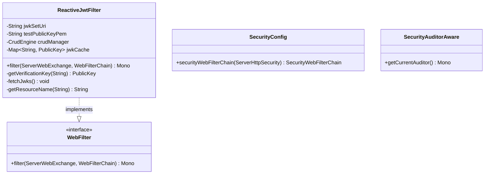
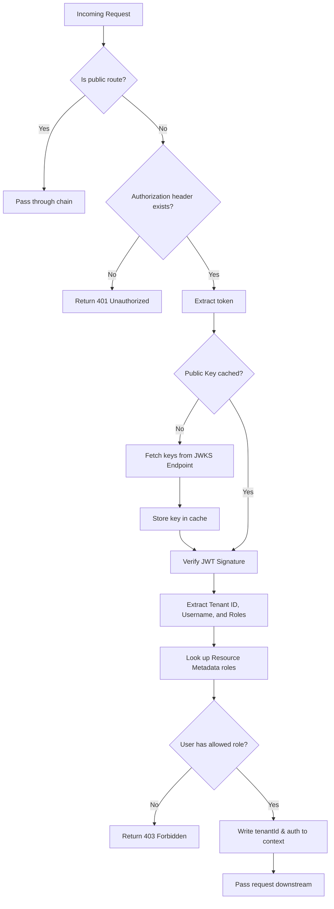

# Keycloak Security Module Architecture (Mermaid)

This file contains Mermaid diagrams visualizing the structure and design of the Keycloak security integration module (`crud-engine-security-keycloak`).

## 1. Class Structure

## 2. JWT Verification and RBAC Flow

